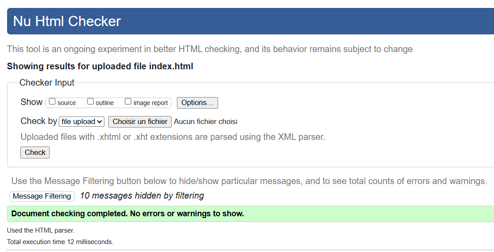
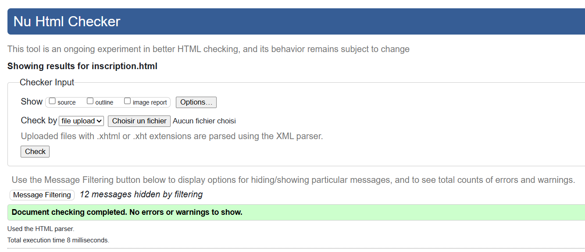

# WebCraft Solutions – Portfolio (Front-end sans framework)

Ce projet réalise un **portfolio interactif** pour l’agence _WebCraft Solutions_ en **HTML5 + CSS + JavaScript natif (ES6 modules)**, sans framework.

---

## 🚀 Fonctionnalités

- Chargement des projets via `fetch()`
- Filtrage dynamique par **technologie** (sans rechargement)
- **Modal** accessible (focus trap, `Esc`, overlay, `aria-*`)
- **Loader**, gestion des erreurs réseau, messages utilisateur
- **Formulaire contact** avec validation côté client
- Design responsive + **palette pastel** (FAD0C9, FAD6A5, FFABAB, FFC3A0, D5AAFF)
- Accessibilité : `alt`, `role="dialog"`, `aria-modal`, `aria-labelledby`, **skip-link**, `aria-live`
- Images optimisées : `loading="lazy"`, `decoding="async"`

---

## 🗂️ Arborescence (extrait)

```
.
├── index.html
├── about.html
├── contact.html
├── js/
│   └── main.js
├── css/
│   └── style.css
└── w3c/
    ├── validation-index.png  (index.html)
    └── validation-inscription.png  (inscription.html)
```

---

## 🛠️ Lancer le projet

Aucun build requis (Tailwind via **CDN**).

- Ouvrir `index.html` dans un navigateur moderne (Chrome/Edge/Firefox).
- Recommandé : servir via un petit serveur local (ex. VSCode _Live Server_) pour les requêtes AJAX.

---

## ✅ Validation W3C

Les deux pages **passent sans erreur ni warning** (Nu Html Checker). Captures :

### index.html



### inscription.html



---

## 📄 Licence

Projet d’évaluation pédagogique — usage libre.
